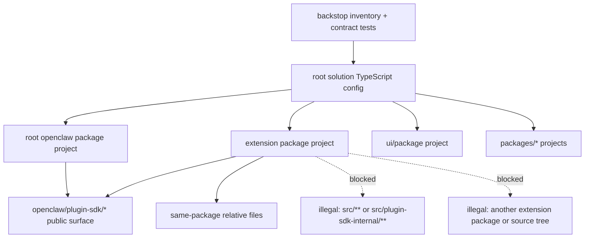
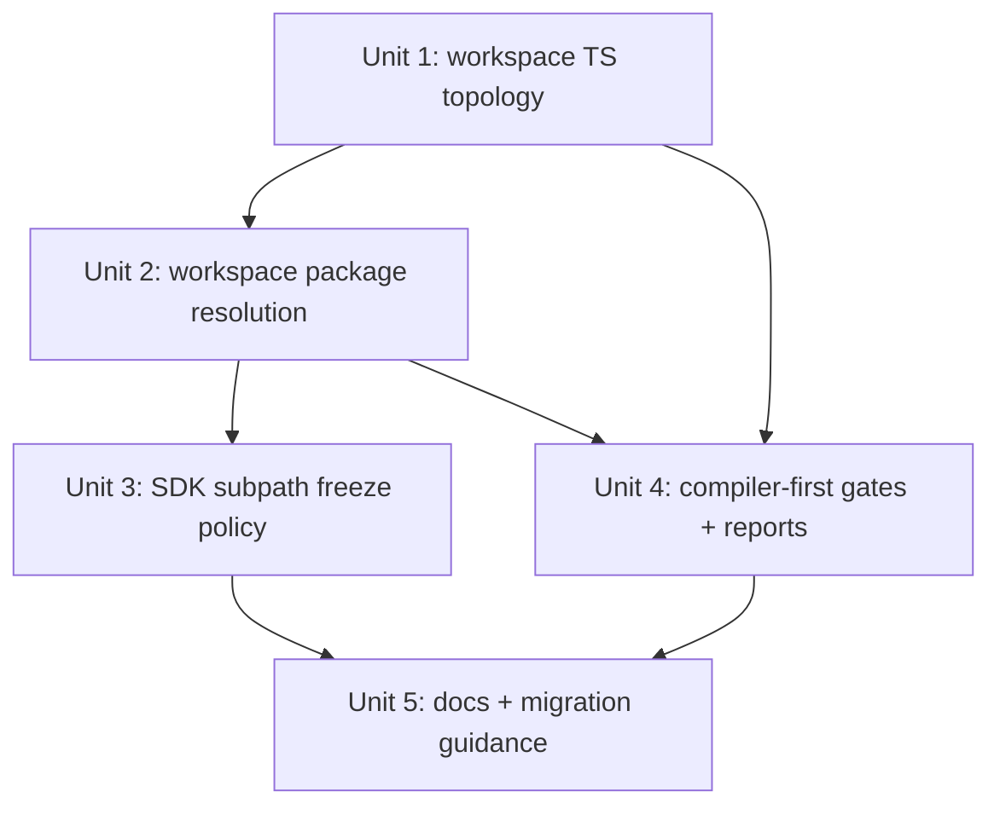

# refactor: Enforce bundled plugin package boundaries

## Overview

This plan makes bundled plugin boundaries fail closed without a large directory
move. Phase 1 focuses on replacing the current "one root TypeScript project +
source path aliases" model with package-local TypeScript projects, workspace
package resolution, and compiler-first boundary failures for production code
under `extensions/*`.

The target rule is narrow and intentional: bundled plugin production code may
import only `openclaw/plugin-sdk/*` and same-package relative paths. If current
imports rely on accidental access to `src/**`, `src/plugin-sdk-internal/**`, or
another bundled plugin package, they should break. Restoring justified cases is
follow-up interface work, not part of this enforcement change.

## Problem Frame

OpenClaw already has the right architectural intent in docs, AGENTS guides, and
boundary scripts, but the toolchain still teaches contributors the opposite
lesson. The current root `tsconfig.json` includes `src/**/*`, `ui/**/*`,
`extensions/**/*`, and `packages/**/*` in one project, and it maps
`openclaw/plugin-sdk/*` directly to `src/plugin-sdk/*.ts`. That makes the whole
repo look importable from extension code even when the documented boundary says
otherwise.

As a result:

- editor autocomplete and jump-to-definition can suggest illegal imports
- AI agents see core internals as if they were part of the extension contract
- custom boundary scripts do important work, but too late in the feedback loop
- accidental dependency leakage is hard to distinguish from real shared seams

This plan preserves the current layout in phase 1 and tightens the enforcement
model underneath it. The architecture should become true because the package and
compiler model make it true, not because contributors memorize policy text.

## Requirements Trace

- R1-R4. Bundled plugin production code under `extensions/*` may import only
  `openclaw/plugin-sdk/*` plus same-package relative paths, and illegal imports
  should intentionally break.
- R5-R8. `openclaw/plugin-sdk/*` remains the canonical cross-package plugin
  contract, but plugin-specific SDK subpaths are treated as migration debt to
  freeze or reduce, not as precedent for further growth.
- R9-R12. Enforcement should come primarily from package resolution and
  package-local TypeScript boundaries, with minimal file movement in phase 1.
- R13-R15. Phase 1 should target bundled plugin enforcement first, preserve a
  path for later SDK cleanup, and produce actionable breakage reports for
  maintainers.

## Scope Boundaries

- No repo-wide physical move of `src/`, `extensions/`, `packages/`, or `ui/` in
  phase 1.
- No new allowed cross-plugin contract surface beyond
  `openclaw/plugin-sdk/*`.
- No new rule that bundled plugins may import other bundled plugin package
  exports.
- No immediate split of `src/cli`, gateway internals, or channels into
  separately published workspace packages.
- No automatic restoration of broken imports in the same project. If a broken
  import reveals a legitimate seam, that becomes later interface work.
- No requirement that every existing plugin-specific `plugin-sdk` subpath be
  removed in phase 1. The policy goal is "freeze and classify now, reduce later."

## Context & Research

### Relevant Code and Patterns

- `pnpm-workspace.yaml` already defines a real workspace with `.`, `ui`,
  `packages/*`, and `extensions/*`.
- `tsconfig.json` is the main leak point today:
  - it includes `src/**/*`, `ui/**/*`, `extensions/**/*`, and `packages/**/*`
    in one project
  - it maps `openclaw/plugin-sdk/*` to `src/plugin-sdk/*.ts`
  - it maps `@openclaw/*` to `extensions/*`
- `package.json` already publishes `openclaw/plugin-sdk/*` through `exports`,
  which is the right contract shape for consumers.
- `tsdown.config.ts` already builds the root package, SDK subpaths, and bundled
  plugin entrypoints in one graph; phase 1 should avoid destabilizing that build
  shape unnecessarily.
- `extensions/AGENTS.md`, `src/plugin-sdk/AGENTS.md`, and `src/plugins/AGENTS.md`
  already describe the desired boundary accurately.
- Existing backstop enforcement is strong and should be preserved:
  - `scripts/check-extension-plugin-sdk-boundary.mjs`
  - `scripts/check-plugin-extension-import-boundary.mjs`
  - `scripts/check-no-extension-src-imports.ts`
  - `src/plugins/contracts/plugin-sdk-subpaths.test.ts`
  - `src/plugins/contracts/plugin-sdk-package-contract-guardrails.test.ts`
  - `src/plugins/contracts/plugin-sdk-runtime-api-guardrails.test.ts`
- Existing workspace package patterns already exist in:
  - `packages/plugin-package-contract/package.json`
  - `packages/memory-host-sdk/package.json`

### Extension Import Scan Findings

The current extension graph already shows a strong generic seam model. The most
frequently imported SDK subpaths in extension production code are generic
contracts such as `config-runtime`, `core`, `runtime-env`, `routing`,
`reply-runtime`, `provider-model-shared`, `channel-contract`, `media-runtime`,
and `plugin-entry`.

That supports the brainstorm conclusion that the real shared seam families are:

- provider seams
- channel seams
- config/account/secret seams
- runtime/store seams
- capability seams such as CLI backend, speech, media understanding, realtime
  voice, sandbox, ACP, and memory host helpers

The same scan also shows a smaller, localized set of plugin-specific SDK usage,
including subpaths such as `googlechat`, `msteams`, `nextcloud-talk`,
`matrix-runtime-shared`, `browser-support`, `nostr`, `tlon`, and
`memory-core-host-*`. Those are the current migration-debt surface to freeze,
not evidence that bundled plugins should get broader package-to-package rights.

### Institutional Learnings

No matching `docs/solutions/` entries were present in this worktree for this
topic. The most relevant institutional guidance currently lives in AGENTS files,
contract tests, and the existing boundary-check scripts.

### External References

- TypeScript project references:
  `https://www.typescriptlang.org/docs/handbook/project-references.html`
- TypeScript guidance against using `paths` to point at monorepo packages:
  `https://www.typescriptlang.org/docs/handbook/modules/reference.html#paths-should-not-point-to-monorepo-packages-or-node_modules-packages`
- Node package `exports` and self-reference:
  `https://nodejs.org/api/packages.html#self-referencing-a-package-using-its-name`
- pnpm workspace filtering:
  `https://pnpm.io/filtering`

## Key Technical Decisions

- **Extensions are the phase-1 fail-closed boundary.**
  Phase 1 does not require a whole-repo package split. The first goal is to make
  `extensions/*` obey a real package boundary and stop seeing the repo as one
  source tree.

- **Adopt a solution-style TypeScript topology.**
  Replace the current include-everything root project with:
  - a shared base config
  - `tsconfig.workspace.json` as the root solution config that wires references
    together
  - a narrowed `tsconfig.json` for the root `openclaw` package project
  - package-local projects for `extensions/*`, `packages/*`, and `ui/`

- **Stop using root path aliases as the extension enforcement mechanism.**
  Extension projects should resolve `openclaw/plugin-sdk/*` through the actual
  `openclaw` workspace package and project references, not through
  `paths -> src/plugin-sdk/*.ts`.

- **Use workspace development dependencies, not runtime `workspace:*` deps.**
  Bundled plugins should declare `openclaw` as a workspace development
  dependency, and peer metadata only where genuinely needed. This aligns with
  the repo rule that bundled plugin runtime deps must not rely on
  `workspace:*` in `dependencies`.

- **Keep `openclaw/plugin-sdk/*` as the only allowed cross-package extension surface.**
  Local `api.ts`, `runtime-api.ts`, `config-api.ts`, and similar barrels remain
  same-package convenience seams. They do not become new cross-plugin contract
  rights.

- **Freeze plugin-specific SDK growth in phase 1.**
  Existing plugin-specific SDK subpaths stay working where already published,
  but no new plugin-named subpaths should be added casually. New cross-package
  needs must either reuse a generic seam or become later interface work.

- **Retain scripts and contract tests as backstops.**
  The compiler and package resolver should fail first, but the existing boundary
  scripts and contract tests still matter for full inventory, regression
  coverage, and policy drift detection.

- **Do not package-split the CLI in phase 1.**
  The current repo already exposes legitimate CLI-related shared seams through
  SDK entries such as `cli-backend` and `cli-runtime`. Giving the CLI its own
  package is a later architectural option, not a prerequisite for enforcing
  bundled plugin boundaries now.

## Open Questions

### Resolved During Planning

- **Which TypeScript projects are minimally required in phase 1?**
  `tsconfig.base.json`, `tsconfig.workspace.json`, a narrowed root
  `tsconfig.json`, `ui/tsconfig.json`, `packages/*/tsconfig.json`, and
  `extensions/*/tsconfig.json`.

- **Which core slices must become standalone package boundaries now?**
  None beyond the workspace packages that already exist. The root `openclaw`
  package remains the host for `plugin-sdk` in phase 1.

- **How should pnpm, package `exports`, and project references work together?**
  Bundled plugins should typecheck against the `openclaw` workspace package,
  package `exports` remain the published surface, and TypeScript project
  references provide editor/compiler linkage without restoring source-alias
  escape hatches.

- **How should maintainers measure breakage?**
  Use package-local typechecking as the primary failure signal and keep the
  existing inventory scripts in report mode so maintainers get an exhaustive,
  categorized breakage artifact.

- **What is the phase-1 stance on plugin-specific SDK subpaths?**
  Freeze them, classify them, and stop new growth. Their eventual reduction is
  intentionally deferred.

### Deferred to Implementation

- **The exact initial frozen-subpath allowlist.**
  The policy is clear, but the final list should be generated from the current
  export surface and reviewed once implementation starts.

- **Whether `ui/` should get a fully independent long-term build/typecheck flow.**
  Phase 1 only needs enough separation to keep the root solution coherent after
  extensions leave the root project.

- **Whether later phases should package-split `src/cli`, channel internals, or
  gateway internals.**
  Those are future architecture projects, not blockers for this enforcement
  change.

## High-Level Technical Design

| Concern                      | Current model                                                  | Target phase-1 model                                             |
| ---------------------------- | -------------------------------------------------------------- | ---------------------------------------------------------------- |
| Extension type boundary      | One root TS project sees the whole repo                        | Each extension has its own TS project rooted at its package      |
| SDK resolution               | `paths` aliases jump directly to `src/plugin-sdk/*.ts`         | Workspace package + project references + package exports         |
| Illegal import failure point | Mostly custom scripts and CI                                   | Editor/package-local typecheck first, scripts second             |
| Cross-plugin access          | Easy to reach accidentally through aliases and repo visibility | Only `openclaw/plugin-sdk/*` plus same-package relative imports  |
| Plugin-specific SDK sprawl   | Existing exports are easy to treat as precedent                | Existing plugin-specific seams are frozen and explicitly tracked |

> _This illustrates the intended approach and is directional guidance for review,
> not implementation specification. The implementing agent should treat it as
> context, not code to reproduce._

## Implementation Units

- [ ] **Unit 1: Establish workspace-local TypeScript project boundaries**

**Goal:** Convert the current root TypeScript topology into a solution-style
workspace model so bundled plugins become real package projects instead of files
inside one giant root project.

**Requirements:** R1, R2, R3, R9, R10, R11, R12, R13

**Dependencies:** None

**Files:**

- Create: `tsconfig.base.json`
- Create: `tsconfig.workspace.json`
- Create: `ui/tsconfig.json`
- Create: `packages/*/tsconfig.json`
- Create: `extensions/*/tsconfig.json`
- Modify: `tsconfig.json`
- Modify: `tsconfig.plugin-sdk.dts.json`
- Test: `src/plugins/contracts/extension-package-project-boundaries.test.ts`

**Approach:**

- Move shared compiler options out of the current root config so package-local
  projects inherit one consistent baseline.
- Add `tsconfig.workspace.json` as the references-oriented solution entry and
  narrow `tsconfig.json` into the root `openclaw` package project instead of an
  include-everything repo project.
- Give every bundled plugin its own TypeScript project whose source boundary is
  the package root, excluding sibling extensions and repo-level source trees.
- Keep the root `openclaw` package project as the owner of `src/plugin-sdk/*`
  and other core source, but stop that project from directly including
  `extensions/**/*`.
- Add a guardrail test that every bundled plugin package has a local TypeScript
  project and that the project does not silently reintroduce repo-wide includes
  or root source aliases.

**Execution note:** Land the initial topology against a small representative
pilot set first, then template it across the extension tree. The best pilot mix
is one provider plugin, one channel plugin, one extension that already uses a
frozen plugin-specific SDK subpath, and one workspace package under `packages/*`.

**Patterns to follow:**

- `packages/plugin-package-contract/package.json`
- `packages/memory-host-sdk/package.json`
- `scripts/check-extension-plugin-sdk-boundary.mjs`

**Test scenarios:**

- Happy path: an extension-local project can resolve same-package relative
  imports and `openclaw/plugin-sdk/*` imports without seeing sibling extension
  source files.
- Edge case: a relative import that climbs above the extension package root
  fails project typechecking.
- Edge case: the root `openclaw` project no longer implicitly includes
  `extensions/**/*`.
- Integration: opening the repo in an editor preserves cross-project navigation
  through TypeScript references without restoring direct access to `src/**` from
  extension code.

**Verification:**

- Bundled plugins are independently typecheckable as package-local projects.
- Illegal repo-wide imports stop resolving before custom boundary scripts run.

- [ ] **Unit 2: Rewire bundled plugin resolution to real package contracts**

**Goal:** Make extension development depend on the `openclaw` workspace package
contract instead of root source aliases.

**Requirements:** R1, R2, R3, R4, R9, R10, R11, R13

**Dependencies:** Unit 1

**Files:**

- Modify: `package.json`
- Modify: `extensions/*/package.json`
- Modify: `src/plugins/contracts/plugin-sdk-package-contract-guardrails.test.ts`
- Modify: `src/plugins/contracts/plugin-sdk-index.bundle.test.ts`
- Test: `src/plugins/contracts/plugin-sdk-package-contract-guardrails.test.ts`

**Approach:**

- Add `openclaw` as the explicit workspace development dependency for bundled
  plugin packages so editor and typechecker resolution is anchored in package
  metadata rather than repo visibility.
- Remove extension reliance on the root `@openclaw/*` alias and the direct
  `paths -> src/plugin-sdk/*.ts` escape hatch once project references provide a
  supported resolution path.
- Keep published npm/package behavior anchored on `package.json` `exports`; this
  unit changes workspace/editor resolution, not the public package shape.
- Extend package-contract tests so missing or misconfigured extension package
  metadata fails loudly.

**Patterns to follow:**

- `package.json`
- `src/plugin-sdk/entrypoints.ts`
- `src/plugins/contracts/plugin-sdk-package-contract-guardrails.test.ts`

**Test scenarios:**

- Happy path: a bundled plugin package resolves
  `openclaw/plugin-sdk/provider-entry` and other public SDK subpaths through
  workspace package resolution.
- Edge case: imports to `@openclaw/<other-plugin>` or sibling extension source
  files remain unresolved from bundled plugin production code.
- Error path: an extension package that omits the required `openclaw`
  development dependency fails the contract guard.
- Integration: package/pack checks still expose the same published
  `openclaw/plugin-sdk/*` surface to external consumers.

**Verification:**

- Bundled plugin development no longer depends on repo-local source aliasing.
- The root package still publishes the same SDK contract to external consumers.

- [ ] **Unit 3: Freeze plugin-specific SDK debt and codify subpath policy**

**Goal:** Prevent further growth of plugin-specific SDK seams while keeping the
current published surface explicit and reviewable.

**Requirements:** R5, R6, R7, R8, R14, R15

**Dependencies:** Unit 2

**Files:**

- Create: `scripts/lib/plugin-sdk-subpath-policy.json`
- Modify: `scripts/lib/plugin-sdk-entrypoints.json`
- Modify: `src/plugin-sdk/entrypoints.ts`
- Modify: `src/plugins/contracts/plugin-sdk-subpaths.test.ts`
- Modify: `src/plugins/contracts/plugin-sdk-package-contract-guardrails.test.ts`
- Modify: `docs/plugins/sdk-overview.md`
- Test: `src/plugins/contracts/plugin-sdk-subpaths.test.ts`

**Approach:**

- Introduce explicit metadata that classifies SDK subpaths as generic public
  seams, frozen plugin-specific seams, or denied/internal names.
- Seed the initial frozen set from the current published surface and extension
  import scan rather than from guesses.
- Extend contract tests so a new plugin-named subpath cannot land without
  explicit policy review.
- Keep existing frozen plugin-specific subpaths functional for now, but remove
  any implication that they are the preferred architectural direction.

**Patterns to follow:**

- `src/plugins/contracts/plugin-sdk-subpaths.test.ts`
- `src/plugins/contracts/plugin-sdk-runtime-api-guardrails.test.ts`
- `docs/plugins/sdk-overview.md`

**Test scenarios:**

- Happy path: generic SDK subpaths remain aligned across the generated entrypoint
  list, package exports, and public docs.
- Edge case: adding a new plugin-named SDK subpath without policy metadata fails
  contract tests.
- Edge case: previously banned bundled-channel prefixes such as `discord`,
  `slack`, `telegram`, `signal`, and `whatsapp` remain excluded from the public
  SDK list.
- Integration: the subpath policy metadata and the generated/package contract
  tests stay synchronized.

**Verification:**

- New plugin-specific SDK growth cannot land accidentally.
- Reviewers can see which plugin-specific seams are frozen debt versus generic
  public contract.

- [ ] **Unit 4: Promote compiler-first boundary gates and breakage reporting**

**Goal:** Make package/type resolution the primary failure mode while preserving
human-readable boundary inventory for maintainers.

**Requirements:** R2, R3, R4, R9, R10, R11, R12, R15

**Dependencies:** Unit 1, Unit 2

**Files:**

- Create: `scripts/report-extension-boundary-breakage.mjs`
- Modify: `package.json`
- Modify: `vitest.boundary.config.ts`
- Modify: `scripts/check-extension-plugin-sdk-boundary.mjs`
- Modify: `scripts/check-plugin-extension-import-boundary.mjs`
- Modify: `scripts/check-no-extension-src-imports.ts`
- Modify: `test/fixtures/extension-src-outside-plugin-sdk-inventory.json`
- Modify: `test/fixtures/extension-plugin-sdk-internal-inventory.json`
- Modify: `test/fixtures/extension-relative-outside-package-inventory.json`
- Test: `src/plugins/contracts/extension-package-project-boundaries.test.ts`

**Approach:**

- Add explicit workspace verification that exercises bundled plugin package
  projects directly instead of depending on the root project to catch illegal
  imports.
- Keep the existing boundary scripts, but shift them toward machine-readable
  inventory/report output and regression detection rather than being the only
  thing that makes violations visible.
- Preserve separate violation classes such as:
  - core `src/**` imports
  - `src/plugin-sdk-internal/**` imports
  - relative escapes outside the package root
  - cross-extension imports
- Produce a stable breakage artifact that maintainers can sort into:
  - delete the dependency
  - replace it with an existing generic SDK seam
  - record it as a candidate for later interface design

**Patterns to follow:**

- `scripts/check-extension-plugin-sdk-boundary.mjs`
- `scripts/check-plugin-extension-import-boundary.mjs`
- `test/fixtures/*.json` boundary inventories

**Test scenarios:**

- Happy path: an illegal bundled plugin import to core `src/**` fails through
  package-local typechecking before inventory scripts run.
- Edge case: a relative escape import is still captured in the report output
  even when the compiler already fails.
- Error path: the generated breakage inventory distinguishes the violation class
  and records the offending extension, specifier, and resolved path.
- Integration: the architecture/CI lane can present both the hard failure and a
  full inventory artifact without duplicating classification logic.

**Verification:**

- Illegal imports fail early in normal verification.
- Maintainers still get an exhaustive, categorized view of the remaining
  breakage during rollout.

- [ ] **Unit 5: Align docs, AGENTS guidance, and migration instructions**

**Goal:** Make contributor guidance, AI guidance, and public SDK docs describe
the same fail-closed boundary that the compiler now enforces.

**Requirements:** R1, R2, R3, R5, R10, R11, R12, R15

**Dependencies:** Unit 3, Unit 4

**Files:**

- Modify: `extensions/AGENTS.md`
- Modify: `src/plugin-sdk/AGENTS.md`
- Modify: `src/plugins/AGENTS.md`
- Modify: `docs/plugins/building-plugins.md`
- Modify: `docs/plugins/sdk-overview.md`
- Modify: `docs/plugins/sdk-entrypoints.md`
- Modify: `docs/plugins/sdk-migration.md`
- Modify: `docs/plugins/architecture.md`

**Approach:**

- Update guidance so it clearly states that bundled plugins do not get stronger
  import rights than third-party plugins.
- Document the new resolution model: package-local TypeScript projects, explicit
  `openclaw` development dependency, compiler-first failures, and frozen
  plugin-specific SDK seams.
- Update migration docs so a broken import points contributors toward the right
  follow-up decision: delete it, swap to an existing generic seam, or capture it
  for later interface design.

**Patterns to follow:**

- `extensions/AGENTS.md`
- `src/plugin-sdk/AGENTS.md`
- `docs/plugins/sdk-overview.md`

**Test scenarios:**

- Test expectation: none -- this unit updates documentation and contributor
  guidance rather than runtime behavior.

**Verification:**

- Repo guidance no longer implies that bundled plugins may reach into sibling
  packages or core internals.
- The public docs explain what breaks, why it breaks, and what maintainers
  should do next.

## System-Wide Impact

- **Interaction graph:** This change touches the root TypeScript topology,
  workspace package metadata, extension package metadata, SDK export policy,
  contract tests, docs, and AI/contributor guidance.
- **Error propagation:** Illegal imports should surface first in editors and
  package-local typechecking, then in boundary inventory scripts and CI
  contract tests.
- **State lifecycle risks:** Config drift is possible between
  `scripts/lib/plugin-sdk-entrypoints.json`, policy metadata, package exports,
  docs, and per-package TypeScript configs unless contract tests stay aligned.
- **API surface parity:** The following surfaces must move together:
  `package.json` exports, `src/plugin-sdk/entrypoints.ts`,
  `scripts/lib/plugin-sdk-entrypoints.json`, boundary docs, and AGENTS guides.
- **Integration coverage:** Unit tests alone are not enough; the plan relies on
  project-graph verification, contract tests, pack/export guards, and boundary
  inventory fixtures.
- **Unchanged invariants:** Bundled plugins remain in `extensions/*`, the root
  publishable package remains `openclaw`, and cross-plugin imports do not become
  a new supported architecture.

## Alternative Approaches Considered

- **Do a monorepo layout move first.**
  Rejected for phase 1 because it creates massive churn before proving the
  enforcement model. The current workspace already exists; the weak point is the
  TypeScript/package topology, not the lack of top-level folders.

- **Rely on scripts and CI alone.**
  Rejected because it leaves autocomplete, navigation, and AI-assisted editing
  misaligned with the documented contract.

- **Allow bundled plugin package exports as an additional escape hatch.**
  Rejected because it undermines the user's explicit goal: bundled plugins
  should break when they depend on non-interface code.

- **Split CLI into its own package as part of phase 1.**
  Rejected because it increases scope without being required to enforce the
  extension boundary today.

## Risks & Dependencies

| Risk                                                                                                                   | Mitigation                                                                                                                                                                                  |
| ---------------------------------------------------------------------------------------------------------------------- | ------------------------------------------------------------------------------------------------------------------------------------------------------------------------------------------- |
| TypeScript project references and workspace resolution may destabilize editor behavior or existing checks              | Land the topology first, keep the build graph stable where possible, and validate the change with contract tests plus representative pilot packages before templating across the whole tree |
| `openclaw/plugin-sdk/*` workspace resolution may fall back to stale `dist/` artifacts if the project graph is miswired | Anchor extension projects to an explicit root `openclaw` project reference and preserve pack/export tests so source-vs-published resolution mismatches are visible                          |
| Dozens of bundled plugin packages will need similar `package.json` and `tsconfig` changes                              | Generate from a shared template or scripted transform and add a contract test so drift becomes reviewable instead of manual                                                                 |
| Existing plugin-specific SDK seams may hide more coupling than the initial scan showed                                 | Freeze them first, generate inventory, and triage before attempting removals                                                                                                                |
| CI/runtime verification could become slower or noisier                                                                 | Keep compiler-first checks narrow to extension package projects and use pnpm workspace filtering where targeted verification makes sense                                                    |

## Success Metrics

- Illegal bundled plugin imports fail through normal TypeScript/package
  resolution rather than only through custom lint scripts.
- Editing inside `extensions/<id>` shows only legal local imports plus
  `openclaw/plugin-sdk/*` by default.
- The root `tsconfig` no longer makes the full repo appear importable from
  bundled plugin production code.
- New plugin-specific SDK subpaths cannot be added without explicit policy
  metadata and test updates.
- Maintainers can review a stable breakage report and separate "delete the
  dependency" from "design a new interface later."

## Phased Delivery

### Phase 1

- Land Unit 1 and Unit 2 on a representative pilot set to prove the project
  topology and package resolution model.
- Confirm that the root package, SDK exports, and pack/build contract remain
  stable.

### Phase 2

- Roll the same topology and package metadata changes across the full bundled
  plugin tree.
- Land Unit 3 and Unit 4 so the compiler becomes the primary gate and the repo
  gains stable breakage reporting.

### Phase 3

- Land Unit 5 and update all contributor-facing guidance.
- Use the generated inventory to queue follow-up interface cleanup work without
  widening phase-1 scope.

## Documentation / Operational Notes

- During rollout, use one provider plugin, one channel plugin, one extension
  that already consumes a frozen plugin-specific SDK subpath, and one
  `packages/*` workspace package as the standing regression quartet.
- The breakage report should be durable enough to attach to CI artifacts or PR
  discussion, not just print transient console output.
- When rollout uncovers a justified missing seam, record it as later work
  instead of expanding the SDK during the enforcement change.
- If phase 1 succeeds cleanly, a later project can decide whether a physical
  repo re-layout is still worth doing. This plan does not assume that it is.

## Sources & References

- **Origin document:** `docs/brainstorms/2026-04-04-plugin-boundary-enforcement-requirements.md`
- Related code:
  - `tsconfig.json`
  - `tsconfig.plugin-sdk.dts.json`
  - `pnpm-workspace.yaml`
  - `package.json`
  - `tsdown.config.ts`
  - `src/plugin-sdk/entrypoints.ts`
  - `scripts/check-extension-plugin-sdk-boundary.mjs`
  - `scripts/check-plugin-extension-import-boundary.mjs`
  - `scripts/check-no-extension-src-imports.ts`
  - `src/plugins/contracts/plugin-sdk-subpaths.test.ts`
  - `src/plugins/contracts/plugin-sdk-package-contract-guardrails.test.ts`
  - `src/plugins/contracts/plugin-sdk-runtime-api-guardrails.test.ts`
  - `extensions/AGENTS.md`
  - `src/plugin-sdk/AGENTS.md`
  - `src/plugins/AGENTS.md`
- External docs:
  - `https://www.typescriptlang.org/docs/handbook/project-references.html`
  - `https://www.typescriptlang.org/docs/handbook/modules/reference.html#paths-should-not-point-to-monorepo-packages-or-node_modules-packages`
  - `https://nodejs.org/api/packages.html#self-referencing-a-package-using-its-name`
  - `https://pnpm.io/filtering`
